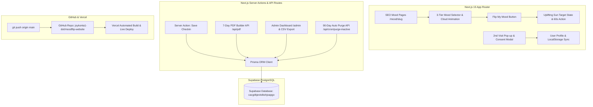

# 💫 MoodFlip - Complete Project Architecture & Deployment Guide

> **AI AGENT INSTRUCTION**: Read this file first when modifying or extending MoodFlip. This document contains the system architecture, database models, deployment pipelines, and operational commands.

---

## 🔑 Services & Credential Management

> Never store access tokens or private credentials in this repository. Keep local values in `.env.local`, GitHub Actions values in repository secrets, and production values in Vercel Environment Variables. Revoke and rotate any credential that was previously committed.

| Service | Key / Token Type | Value |
| :--- | :--- | :--- |
| **GitHub** | Repository URL | [https://github.com/joykonta1-dot/moodflip-website](https://github.com/joykonta1-dot/moodflip-website) |
| **Vercel** | Live Website URL | [https://moodflip-website.vercel.app](https://moodflip-website.vercel.app) |
| **Supabase** | Project Name | `joykonta1-dot's Project` |
| **Supabase** | Project Reference ID | `cacgdkjevkdkshjoapgo` |
| **Supabase** | Project URL | `https://cacgdkjevkdkshjoapgo.supabase.co` |
| **Supabase** | Public Anon Key | Store as `NEXT_PUBLIC_SUPABASE_ANON_KEY` |
| **Domain** | Target Domain | `moodflip.coach` (Namecheap) |

---

## 🏗️ Technical Stack & Architecture Overview



- **Framework**: Next.js 14/15 App Router (React Server Components + Server Actions)
- **Database & ORM**: Prisma ORM (`prisma/schema.prisma`) connected to Supabase PostgreSQL (`cacgdkjevkdkshjoapgo`)
- **Deployment Platform**: Vercel Native Serverless Engine (100% Docker-free)
- **Styling & UI**: Custom Split-Screen Vanilla CSS (`app/globals.css`)
  - Left Panel: Dark background (`#0f1426`) with 5 cartoon cloud mood families (**Sad**, **Disgusted**, **Angry**, **Fearful**, **Bad**), 2nd layer sub-category tiles, 3rd layer specific feeling choices.
  - Right Panel: Warm Uplifting **Sunburst** background (`#fffbe6` ➔ `#fde68a`) with target positive mood state and 60-second micro-action.

---

## 🗄️ Database Schema & Prisma Models

Location: `prisma/schema.prisma`

```prisma
datasource db {
  provider = "postgresql"
  url      = env("DATABASE_URL")
}

generator client {
  provider = "prisma-client-js"
}

model UserProfile {
  id           String        @id @default(uuid())
  email        String        @unique
  name         String?
  visitCount   Int           @default(1)
  isPaid       Boolean       @default(false)
  lastActiveAt DateTime      @default(now())
  createdAt    DateTime      @default(now())
  updatedAt    DateTime      @updatedAt
  checkins     UserCheckin[]
  purchases    Purchase[]

  @@map("user_profiles")
}

model UserCheckin {
  id              String       @id @default(uuid())
  profileId       String?
  profile         UserProfile? @relation(fields: [profileId], references: [id], onDelete: Cascade)
  primaryMood     String       // Sad, Disgusted, Angry, Fearful, Bad
  subFeeling      String       // Layer 2
  specificFeeling String       // Layer 3
  targetMood      String       // Positive target state
  actionShown     String       // 60-second action prompt
  createdAt       DateTime     @default(now())

  @@map("user_checkins")
}

model ActionPrompt {
  id              String   @id @default(uuid())
  primaryMood     String
  specificFeeling String
  targetMood      String
  actionText      String
  createdAt       DateTime @default(now())

  @@map("action_prompts")
}

model Purchase {
  id          String      @id @default(uuid())
  profileId   String
  profile     UserProfile @relation(fields: [profileId], references: [id], onDelete: Cascade)
  amount      Float       @default(7.00)
  status      String      @default("COMPLETED")
  productType String      @default("7_DAY_PDF")
  pdfUrl      String?
  createdAt   DateTime    @default(now())

  @@map("purchases")
}
```

---

## 📋 Features Specification Matrix

### 1. 3-Tier Interactive Mood Selector (No Typing)
- **Step 1**: 5 Cartoon Cloud Mood Families (**Sad**, **Disgusted**, **Angry**, **Fearful**, **Bad**).
- **Step 2**: 2nd Layer sub-category tiles with icon drawings.
- **Step 3**: 3rd Layer specific feelings choices.
- **Step 4**: Soft glowing/pulsing **"Flip My Mood"** center button.
- **Step 5**: Split screen layout: Dark selection left-panel + Warm Uplifting **Sunburst** right-panel showing positive target state & 60-second action.

### 2. 28 Mood Pairings x 10+ Rotating Actions
- Pre-loaded in `lib/moodData.ts`.
- Architecture supports 30+ actions per mood for Phase 2 without database restructuring.

### 3. Repeat Visitor Tracking & 2nd Visit Pop-Up
- Browser `localStorage` visit counter (`moodflip_visit_count`).
- On visit #2, pop-up modal triggers with exact approved consent text:
  > *"By creating a profile, you agree that MoodFlip may store your email address, selected moods and dates, actions shown, and purchase history so we can create and offer personalized downloads."*

### 4. Automatic 90-Day Inactive Profile Deletion
- Database field `last_active_at` on `UserProfile`.
- Daily cron API route at `/api/cron/purge-inactive` purges inactive profiles >90 days old.

### 5. Secure Admin Dashboard (`/admin`)
- Password protected (`admin123`).
- Displays registered users' names, emails, visit counts, check-ins, and purchase status (`ACTIVE_PAID ($7)` vs `INACTIVE (FREE)`).
- One-click **Export Users to CSV** button.

### 6. Paid 7-Day Personalised PDF Plan ($7)
- Instant PDF builder API at `/api/pdf?email=user@example.com` powered by `pdf-lib`.

### 7. SEO Foundation & Google Setup
- Programmatic SEO mood pages at `/mood/[slug]` (e.g., `/mood/anxious-at-night`, `/mood/overwhelmed-work`).
- Schema.org structured data, XML sitemap (`public/sitemap.xml`), `public/robots.txt`.
- Built-in top and bottom **AdSense placement containers** (`<AdSpace position="top" />` and `<AdSpace position="bottom" />`).

---

## ⚡ AI Vibe-Coding Workflow & Developer Commands

When adding new features or vibe-coding with AI in the future:

### 1. Make Changes Locally
Edit files in your editor.

### 2. Test Build & Type Compliance
```bash
# Check TypeScript types
npx tsc --noEmit

# Test production build
npm run build
```

### 3. Push Database Schema Changes to Supabase
```bash
npx prisma db push
```

### 4. Push Updates to GitHub (Automatic Live Vercel Deployment)
```bash
git add .
git commit -m "Describe your changes"
git push origin main
```
> **Automatic Action**: Every `git push origin main` triggers Vercel CI/CD pipeline, rebuilding and deploying the live site at `https://moodflip-website.vercel.app` in ~30 seconds!

---

## 🛠️ Key File Locations Reference

- [app/page.tsx](file:///c:/Users/admin/Documents/MoodFlip%20-%20Self-Help%20Utility%20Website/app/page.tsx): Main homepage & PDF monetization.
- [components/MoodTool.tsx](file:///c:/Users/admin/Documents/MoodFlip%20-%20Self-Help%20Utility%20Website/components/MoodTool.tsx): 3-tier Mood selector & split sunburst target card.
- [components/CloudVector.tsx](file:///c:/Users/admin/Documents/MoodFlip%20-%20Self-Help%20Utility%20Website/components/CloudVector.tsx): Cartoon cloud vector animations.
- [components/ProfileModal.tsx](file:///c:/Users/admin/Documents/MoodFlip%20-%20Self-Help%20Utility%20Website/components/ProfileModal.tsx): 2nd visit email capture modal.
- [components/AdSpace.tsx](file:///c:/Users/admin/Documents/MoodFlip%20-%20Self-Help%20Utility%20Website/components/AdSpace.tsx): Top & Bottom AdSense containers.
- [lib/moodData.ts](file:///c:/Users/admin/Documents/MoodFlip%20-%20Self-Help%20Utility%20Website/lib/moodData.ts): 28 Mood pairings and 10 rotating actions dataset.
- [prisma/schema.prisma](file:///c:/Users/admin/Documents/MoodFlip%20-%20Self-Help%20Utility%20Website/prisma/schema.prisma): Database models.
- [app/admin/page.tsx](file:///c:/Users/admin/Documents/MoodFlip%20-%20Self-Help%20Utility%20Website/app/admin/page.tsx): Admin Control Panel & CSV Exporter.
- [app/about/page.tsx](file:///c:/Users/admin/Documents/MoodFlip%20-%20Self-Help%20Utility%20Website/app/about/page.tsx): About & non-medical disclaimer.
- [app/privacy/page.tsx](file:///c:/Users/admin/Documents/MoodFlip%20-%20Self-Help%20Utility%20Website/app/privacy/page.tsx): Privacy Policy & 90-day deletion notice.
- [app/api/pdf/route.ts](file:///c:/Users/admin/Documents/MoodFlip%20-%20Self-Help%20Utility%20Website/app/api/pdf/route.ts): 7-day PDF generator.
- [app/api/cron/purge-inactive/route.ts](file:///c:/Users/admin/Documents/MoodFlip%20-%20Self-Help%20Utility%20Website/app/api/cron/purge-inactive/route.ts): Automatic 90-day cleanup route.
